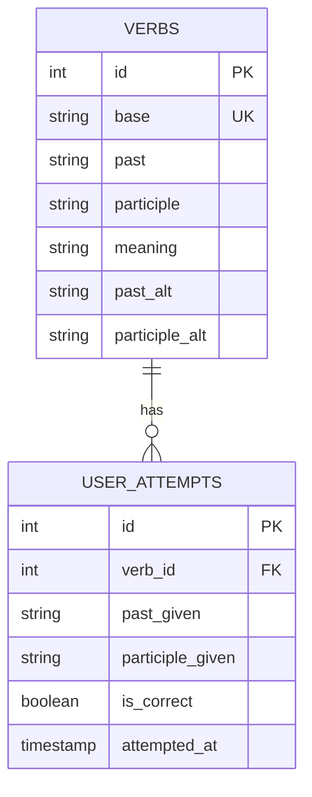

# Database Relationships

Understanding how tables relate to each other.

## Entity Relationship Diagram



## One-to-Many Relationship: Verb → UserAttempt

### Overview

One **Verb** can have many **UserAttempt** records.

```
Verb (id=2, base="go")
    ├── UserAttempt (id=1, verb_id=2, is_correct=true)
    ├── UserAttempt (id=2, verb_id=2, is_correct=false)
    ├── UserAttempt (id=3, verb_id=2, is_correct=true)
    └── UserAttempt (id=4, verb_id=2, is_correct=true)
```

### SQLAlchemy Definition

```python
class Verb(Base):
    __tablename__ = "verbs"
    id = Column(Integer, primary_key=True)

    # One-to-many: one verb has many attempts
    attempts = relationship(
        "UserAttempt",
        back_populates="verb",
        cascade="all, delete-orphan"
    )

class UserAttempt(Base):
    __tablename__ = "user_attempts"
    id = Column(Integer, primary_key=True)
    verb_id = Column(Integer, ForeignKey("verbs.id"), nullable=False)

    # Many-to-one: many attempts reference one verb
    verb = relationship("Verb", back_populates="attempts")
```

### Accessing Related Data

#### From Verb to Attempts

```python
# Get a verb
verb = db.query(Verb).filter_by(base="go").first()

# Access all attempts for this verb
attempts = verb.attempts  # List[UserAttempt]

# Iterate through attempts
for attempt in verb.attempts:
    print(f"Past: {attempt.past_given}, Correct: {attempt.is_correct}")
```

#### From UserAttempt to Verb

```python
# Get an attempt
attempt = db.query(UserAttempt).first()

# Access the associated verb
verb = attempt.verb  # Verb object

print(f"User attempted verb: {verb.base}")
print(f"Correct answer: {verb.past} / {verb.participle}")
```

### SQL Generated

```sql
-- Get verb with all attempts
SELECT * FROM verbs WHERE base = 'go';
SELECT * FROM user_attempts WHERE verb_id = 2;
```

Or with automatic JOINs:

```sql
-- Join approach (with eager loading)
SELECT v.*, ua.*
FROM verbs v
LEFT JOIN user_attempts ua ON ua.verb_id = v.id
WHERE v.base = 'go';
```

### Cascade Behavior

```python
cascade="all, delete-orphan"
```

**Behavior**: If a verb is deleted, all related attempts are automatically deleted.

```python
# Delete a verb
verb = db.query(Verb).filter_by(base="test_verb").first()
db.delete(verb)
db.commit()

# Result: All UserAttempt records with this verb_id are also deleted
# (Database handles via CASCADE DELETE)
```

**SQL equivalent**:

```sql
DELETE FROM verbs WHERE base = 'test_verb';
-- PostgreSQL automatically deletes:
DELETE FROM user_attempts WHERE verb_id = 2;
```

---

## Foreign Key Constraint

### SQL Definition

```sql
ALTER TABLE user_attempts
ADD CONSTRAINT fk_user_attempts_verb_id
FOREIGN KEY (verb_id) REFERENCES verbs(id);
```

### Referential Integrity

**Protections**:

1. **Insert Protection**: Can't insert UserAttempt with non-existent verb_id

```python
# ❌ This fails
attempt = UserAttempt(verb_id=9999, ...)  # 9999 doesn't exist
db.add(attempt)
db.commit()  # IntegrityError: Foreign key constraint violated
```

2. **Delete Protection**: Can't delete verb if attempts exist (with CASCADE)

```python
# With CASCADE: deletes attempts automatically
verb = db.query(Verb).filter_by(id=2).first()
db.delete(verb)
db.commit()  # Succeeds, attempts also deleted

# Without CASCADE: would fail
# IntegrityError: Foreign key constraint violated
```

3. **Update Protection**: If you try to change verb_id to invalid value

```python
# ❌ This fails
attempt = db.query(UserAttempt).first()
attempt.verb_id = 9999  # Invalid
db.commit()  # IntegrityError
```

---

## Query Patterns

### Get All Attempts for a Verb

```python
verb = db.query(Verb).filter_by(base="go").first()
attempts = db.query(UserAttempt).filter_by(verb_id=verb.id).all()

# Equivalent:
attempts = verb.attempts
```

### Get All Verbs with Their Attempt Counts

```python
from sqlalchemy import func

verbs_with_counts = db.query(
    Verb.base,
    func.count(UserAttempt.id).label("attempt_count")
).outerjoin(
    UserAttempt, UserAttempt.verb_id == Verb.id
).group_by(
    Verb.base
).all()

# Result: [("go", 5), ("take", 3), ("read", 0), ...]
```

### Get Verbs with Most Mistakes

```python
hardest_verbs = db.query(
    Verb.base,
    func.count(UserAttempt.id).label("error_count")
).join(
    UserAttempt, UserAttempt.verb_id == Verb.id
).filter(
    UserAttempt.is_correct == False
).group_by(
    Verb.base
).order_by(
    func.count(UserAttempt.id).desc()
).limit(5).all()

# Result: [("go", 5), ("take", 3), ("read", 2), ...]
```

### Filter Attempts by Correctness

```python
# Get only correct attempts for a verb
correct_attempts = db.query(UserAttempt).filter(
    UserAttempt.verb_id == verb.id,
    UserAttempt.is_correct == True
).all()

# Calculate accuracy for this verb
total = len(verb.attempts)
correct = len(correct_attempts)
accuracy = (correct / total) * 100 if total > 0 else 0
```

### Date Range Queries

```python
from datetime import datetime, timedelta

# Attempts from last 7 days
week_ago = datetime.utcnow() - timedelta(days=7)

recent_attempts = db.query(UserAttempt).filter(
    UserAttempt.attempted_at >= week_ago
).all()
```

---

## Data Consistency Examples

### Example 1: Add New Verb with Attempts

```python
from datetime import datetime

# Create verb
verb = Verb(
    base="test",
    past="tested",
    participle="tested",
    meaning="probar"
)
db.add(verb)
db.flush()  # Get the ID before commit

# Create attempts for this verb
for i in range(3):
    attempt = UserAttempt(
        verb_id=verb.id,
        past_given="tested",
        participle_given="tested",
        is_correct=True,
        attempted_at=datetime.utcnow()
    )
    db.add(attempt)

db.commit()

# Verify
print(len(verb.attempts))  # 3
```

### Example 2: Update Attempts for a Verb

```python
# Mark all attempts for "go" as incorrect
verb = db.query(Verb).filter_by(base="go").first()

for attempt in verb.attempts:
    attempt.is_correct = False

db.commit()

# Verify
correct_count = db.query(UserAttempt).filter(
    UserAttempt.verb_id == verb.id,
    UserAttempt.is_correct == True
).count()
print(correct_count)  # 0
```

### Example 3: Delete Verb and Cascade

```python
# Before delete
verb = db.query(Verb).filter_by(base="test").first()
print(f"Attempts before delete: {len(verb.attempts)}")  # 3

# Delete
db.delete(verb)
db.commit()

# After delete - verb is gone
verb = db.query(Verb).filter_by(base="test").first()
print(verb)  # None

# And all its attempts are gone too
attempts = db.query(UserAttempt).filter_by(verb_id=old_verb_id).count()
print(attempts)  # 0
```

---

## Performance Considerations

### Lazy Loading (Default)

```python
verb = db.query(Verb).filter_by(base="go").first()
# At this point, attempts are NOT loaded

# Loading attempts (causes new query)
for attempt in verb.attempts:
    print(attempt.is_correct)  # Triggers separate SELECT
```

**Problem**: N+1 query problem if you iterate:

```python
# ❌ 101 queries (1 for verbs + 100 for each verb's attempts)
for verb in db.query(Verb).all():
    print(len(verb.attempts))
```

### Eager Loading

```python
from sqlalchemy.orm import joinedload

# ✅ 2 queries (1 for verbs + 1 JOIN for attempts)
verbs = db.query(Verb).options(joinedload(Verb.attempts)).all()

for verb in verbs:
    print(len(verb.attempts))  # Data already loaded
```

### Explicit Join (Best for aggregation)

```python
# ✅ 1 query for aggregation
from sqlalchemy import func

result = db.query(
    Verb.base,
    func.count(UserAttempt.id).label("attempts")
).outerjoin(UserAttempt).group_by(Verb.base).all()
```

---

## Relationship Configuration Options

### back_populates

Enables bidirectional access:

```python
# Verb → UserAttempt
verb.attempts

# UserAttempt → Verb
attempt.verb
```

### cascade

Controls what happens when parent is deleted:

```python
cascade="all, delete-orphan"  # Delete child if parent deleted
cascade="all"                  # Same as above (no orphans in this model)
cascade="save-update"          # Save child if parent saved
cascade="delete, save-update"  # Explicit configuration
```

### lazy

Controls when related data is loaded:

```python
relationship(..., lazy="joined")      # Eager load with JOIN
relationship(..., lazy="subquery")    # Eager load with subquery
relationship(..., lazy="select")      # Default: load when accessed
relationship(..., lazy="selectin")    # Load with separate SELECT
```

---

## Future Relationship Patterns

As the app grows, might add:

### User Model (Phase 5)

```python
class User(Base):
    __tablename__ = "users"
    id = Column(Integer, primary_key=True)
    username = Column(String(50), unique=True)
    attempts = relationship("UserAttempt", back_populates="user")

class UserAttempt(Base):
    # ...
    user_id = Column(Integer, ForeignKey("users.id"))
    user = relationship("User", back_populates="attempts")
```

### Quiz Session Model (Phase 5)

```python
class QuizSession(Base):
    __tablename__ = "quiz_sessions"
    id = Column(Integer, primary_key=True)
    user_id = Column(Integer, ForeignKey("users.id"))
    started_at = Column(DateTime)
    ended_at = Column(DateTime)
    attempts = relationship("UserAttempt", back_populates="session")

class UserAttempt(Base):
    # ...
    session_id = Column(Integer, ForeignKey("quiz_sessions.id"))
    session = relationship("QuizSession", back_populates="attempts")
```

---

## See Also

- [Models & Schema](models.md)
- [Data Flow Guide](../architecture/data-flow.md)
- [SQLAlchemy Relationships](https://docs.sqlalchemy.org/en/20/orm/basic_relationships.html)
