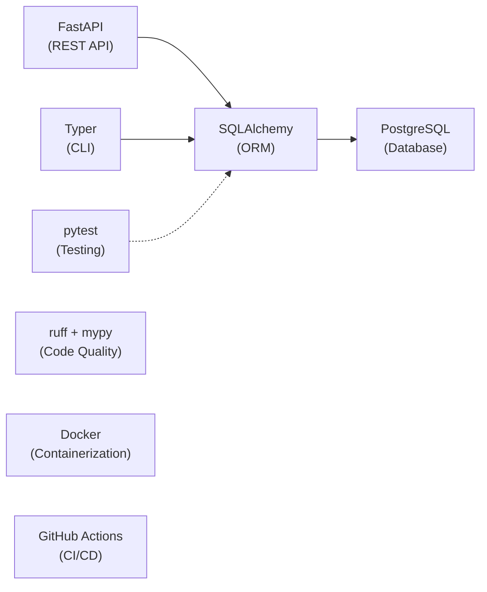

# English Verb Trainer — Technical Documentation

Welcome to the comprehensive technical documentation for the **English Irregular Verb Trainer**, built with production-grade DevOps tooling.

## 🎯 What is this project?

A hybrid application (CLI + Web UI) for practicing English irregular verbs, built with real-world DevOps tools:

  

- **Backend**: FastAPI REST API + Typer CLI
- **Database**: PostgreSQL 15
- **Container Orchestration**: Docker + Docker Compose
- **Infrastructure**: GitHub Actions CI/CD
- **Testing**: pytest with SQLite in-memory for fast isolation
- **Code Quality**: ruff (linting) + mypy (type checking)

## 📊 Quick Stats

| Metric | Value |
|--------|-------|
| Python Version | 3.10+ |
| Database | PostgreSQL 15 |
| Test Coverage | 70%+ |
| Docker Security | Non-root user, slim base |
| CI/CD Platform | GitHub Actions |
| API Framework | FastAPI |
| CLI Framework | Typer |

## 🚀 Getting Started

**First time?** Start here:
- [Quick Start Guide](quick-start.md) — Get running in 5 minutes
- [Project Structure](structure.md) — Understand the codebase layout

## 📚 Documentation Structure

### Core Concepts
- [Architecture Overview](architecture/overview.md) — System design and components
- [Data Flow](architecture/data-flow.md) — Request lifecycle
- [Component Diagram](architecture/components.md) — Relationships

### References
- [CLI Reference](cli-reference.md) — All available commands
- [REST API Endpoints](api/endpoints.md) — Complete endpoint reference
- [Database Models](database/models.md) — Schema and ORM structure

### Development
- [Local Setup](development/setup.md) — How to set up development environment
- [Testing Guide](development/testing.md) — Running and writing tests
- [Contributing](development/contributing.md) — How to contribute

## 🏗️ Technology Stack

## 🔐 Key Features

✅ **Production-Ready**
- Security best practices (non-root user, minimal attack surface, .dockerignore)
- Type hints and static analysis

✅ **Comprehensive Testing**
- 18+ unit tests
- In-memory SQLite for isolation
- Coverage reporting

✅ **CI/CD Automation**
- Automated linting, type checking, and format verification
- Security scanning (Bandit SAST + pip-audit + Trivy)
- Test matrix across Python 3.10, 3.11, 3.12
- Dependency scanning via Dependabot (pip, Docker, Actions)
- Automated releases with GitHub Container Registry + provenance attestation

✅ **Developer Experience**
- Pre-commit hooks for instant feedback
- Makefile for common tasks
- Hot-reload during development

## 📖 Next Steps

1. **New to the project?** → [Quick Start](quick-start.md)
2. **Need API documentation?** → [REST Endpoints](api/endpoints.md)
3. **Troubleshooting?** → [Quick Start](quick-start.md#troubleshooting)

## 📝 License

MIT — Free to use, modify, and distribute.

---

**Last Updated**: 2026-05-12
**Version**: 0.1.0
**Python**: 3.10+
